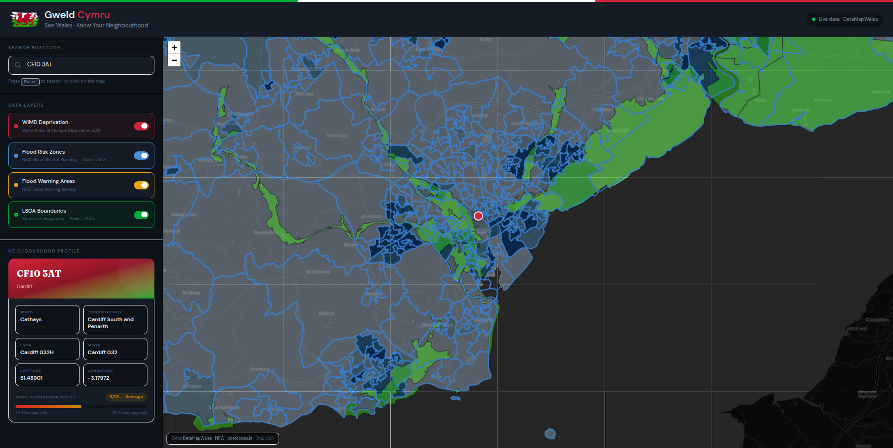

# GweldCymru 🏴󠁧󠁢󠁷󠁬󠁳󠁿

**"See Wales"** — an interactive web app that lets you explore neighbourhood-level data across Wales using live government geospatial data.

Search any Welsh postcode or click anywhere on the map to see deprivation scores, flood risk, and administrative boundaries — all pulled in real-time from [DataMapWales](https://datamap.gov.wales).




## What it does

- Type a Welsh postcode (e.g. CF10 3AT, SA1 1DP) and the map flies to that location showing a neighbourhood profile
- Click anywhere on the map of Wales to reverse-geocode and get the same profile
- Toggle government data layers on/off: WIMD deprivation heatmap, flood risk zones, flood warning areas, LSOA boundaries
- The deprivation decile shown in the profile panel is real data — fetched server-side from the DataMapWales WFS endpoint, not hardcoded

## Understanding the data layers

**WIMD Deprivation (Welsh Index of Multiple Deprivation 2019)**

WIMD is the Welsh Government's official measure of relative deprivation for small areas in Wales. It ranks all 1,909 LSOAs from 1 (most deprived) to 1,909 (least deprived) across eight domains: income, employment, health, education, access to services, housing, community safety, and physical environment. When you toggle this on, the map shows a heatmap where darker areas are more deprived. The decile shown in the profile panel (1-10) tells you which 10% band that area falls into — decile 1 means it's in the most deprived 10% of areas in Wales.

**Flood Risk Zones (NRW Flood Map for Planning — Zones 2 & 3)**

These come from Natural Resources Wales and show areas at risk of flooding from rivers and the sea. Zone 3 has a 1% or greater chance of river flooding in any given year. Zone 2 has between 0.1% and 1% chance. These are used by local authorities when assessing planning applications — if you're building something in a flood zone, you need a flood consequences assessment.

**Flood Warning Areas**

Also from Natural Resources Wales, these show communities where NRW provides an active flood warning service. These are the areas where you'd receive a flood warning if flooding is expected. Not every flood risk zone has a warning service — this layer shows where the monitoring infrastructure actually exists.

**LSOA Boundaries (Lower Layer Super Output Areas — 2021)**

LSOAs are small statistical areas used by the government for reporting data. Wales has 1,909 of them, each containing roughly 1,500 people. They're the building blocks that WIMD and census data are reported against. Toggling this on shows the boundary lines so you can see exactly which LSOA a location falls within.

## Why I built this

I wanted to learn how geospatial web applications work end-to-end: from consuming OGC-standard WMS/WFS services, to geocoding, to building a responsive UI around map data. The project specifically uses the DataMapWales platform because I wanted to understand how government geospatial services are structured.

## Tech stack

- **Next.js 15** (App Router, TypeScript)
- **Leaflet.js** + react-leaflet for the map
- **Tailwind CSS v4** for styling
- **Vercel** for deployment

No database. No auth. One server-side API route.

## Data sources

All data is open and free to use under the [Open Government Licence v3.0](https://www.nationalarchives.gov.uk/doc/open-government-licence/version/3/).

| Layer | Source | Type | Endpoint |
|-------|--------|------|----------|
| WIMD Deprivation | Welsh Government | WMS + WFS | `inspire-wg:wimd2019_overall` |
| Flood Risk Zones | Natural Resources Wales | WMS | `inspire-nrw:NRW_FLOODZONE_RIVERS_SEAS_MERGED` |
| Flood Warning Areas | Natural Resources Wales | WMS | `inspire-nrw:NRW_FLOOD_WARNING` |
| LSOA Boundaries | ONS via DataMapWales | WMS | `geonode:lsoa_2021_w_hwm` |
| Postcode lookup | postcodes.io | REST API | `api.postcodes.io/postcodes/{postcode}` |

All WMS/WFS requests go through `https://datamap.gov.wales/geoserver/ows`.

## How it works

**WMS layers** (the coloured map overlays) are fetched directly by the browser — Leaflet asks DataMapWales for 256x256 tile images and stitches them together. No backend needed for this.

**WFS query** (the actual deprivation numbers in the profile panel) goes through a Next.js API route at `/api/wimd`. When you select a location, the frontend calls this route with lat/lng, and the route makes a server-side WFS GetFeature request to DataMapWales with a BBOX spatial filter. It returns the LSOA's deprivation decile, rank, and quintile.

**Geocoding** uses postcodes.io — a free UK postcode API. Forward lookup for search, reverse lookup for map clicks.

## Running locally

```bash
git clone https://github.com/devinsomniac/gweldcymru.git
cd gweldcymru
npm install
npm run dev
```

Open `http://localhost:3000`. No API keys needed — all data sources are public.

## Project structure

```
app/
├── layout.tsx          — root layout with fonts and grid
├── page.tsx            — main page, holds all state
├── globals.css         — colour tokens and base styles
└── api/wimd/route.ts   — server-side WFS proxy for WIMD data
components/
├── Header.tsx          — Welsh flag branding and live data badge
├── Sidebar.tsx         — assembles search, layers, and profile
├── Map.tsx             — Leaflet map with WMS layers
├── SearchInput.tsx     — postcode search with Enter key handler
├── LayerToggle.tsx     — toggle switch for each data layer
└── ProfilePanel.tsx    — neighbourhood stats and deprivation bar
```

## Roadmap

Things I'd like to add if I continue working on this:

- **Natural language search** — something like "show me deprived areas near Swansea with flood risk" that gets parsed into a WFS query instead of needing an exact postcode
- **Deprivation trend analysis** — if historic WIMD data (2014, 2019) is available, compare how areas have changed over time
- **Active Travel routes layer** — DataMapWales has active travel network data that would be useful to overlay
- **Anomaly detection** — flag LSOAs where deprivation diverges sharply from neighbours, useful for policy officers investigating data quality

## Acknowledgements

- [DataMapWales](https://datamap.gov.wales) — Welsh Government geospatial data platform
- [Natural Resources Wales](https://naturalresources.wales) — flood risk data
- [postcodes.io](https://postcodes.io) — free UK postcode geocoding
- Data used under the Open Government Licence v3.0